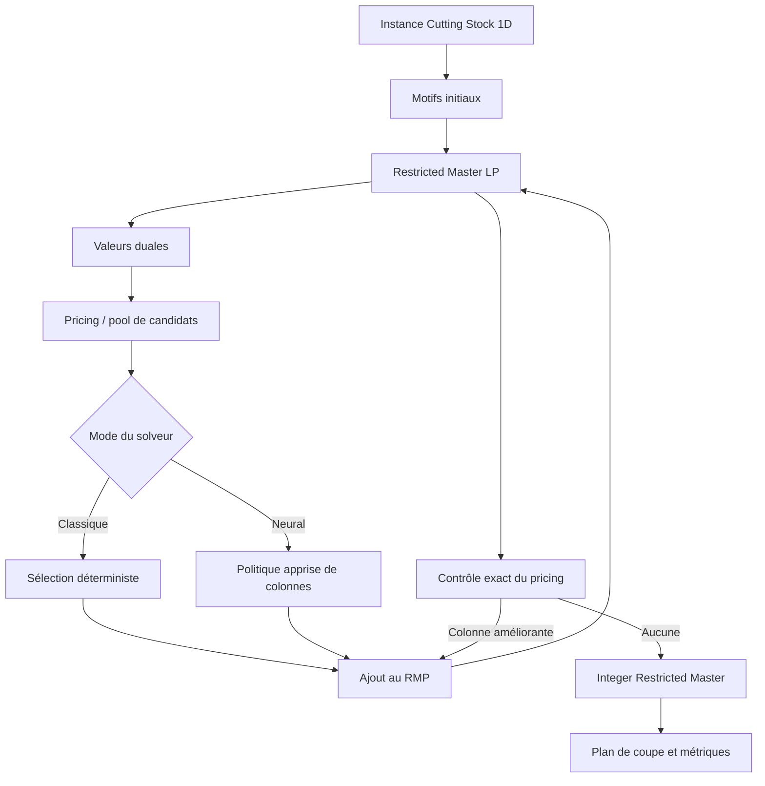
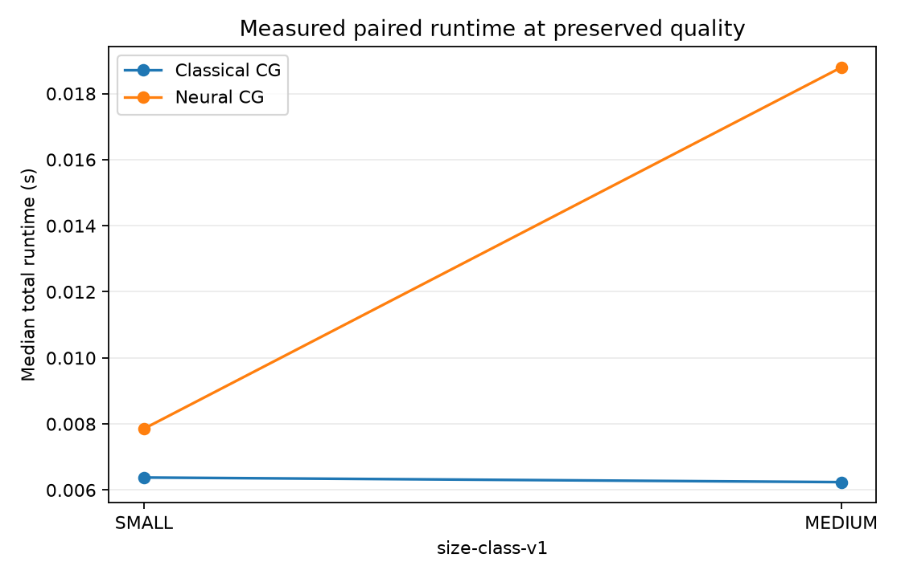
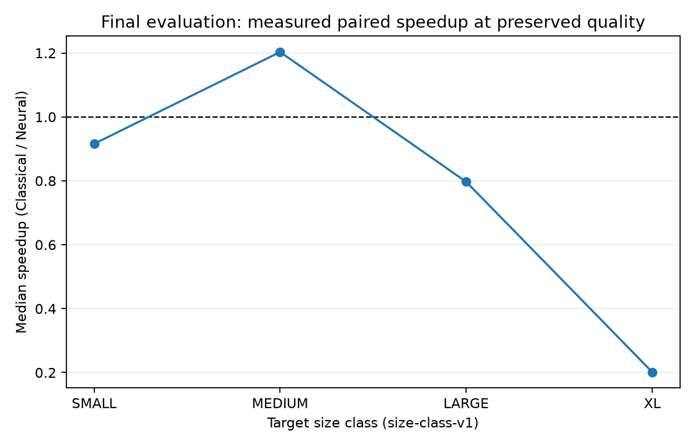

# Neural Cutting Stock — Learning to Accelerate Column Generation

> Projet de recherche en deux temps : les Phases 1 à 6 ont testé si un modèle appris peut accélérer significativement la génération de colonnes pour le Cutting Stock 1D sans dégrader la qualité, avec une réponse mesurée négative ([docs/conclusion.md](docs/conclusion.md)) ; à compter de la Phase 7, le projet étudie si un agent de deep RL peut améliorer la qualité des solutions de découpe (moins de barres, moins de perte) par rapport à la baseline classique, sans aucune contrainte de temps mur-à-mur.

## État du projet

Les sept premières phases du projet sont clôturées. La baseline classique de génération de colonnes comprend la validation des instances et du kerf, le RMP linéaire, le pricing entier exact, la boucle de génération de colonnes, le maître entier restreint, la vérification indépendante et la CLI structurée. La Phase 2 a ajouté un générateur déterministe, un schéma de résultats versionné, un runner classique, la persistance des échecs et limites de ressources, ainsi qu’un profilage par composants. La Phase 3 a ajouté un schéma de trajectoire rejouable, des partitions sans fuite et un petit corpus validé. La Phase 4 ajoute une sélection apprise bornée, un runner apparié et le recalcul des différences de qualité et de runtime depuis les données brutes. La Phase 5 a comparé le coût end-to-end, testé la robustesse de la sélection bornée et documenté l'absence de justification pour une politique séquentielle plus complexe. La Phase 6 a exécuté l'évaluation finale sur 12 instances non vues : la qualité est préservée sur toutes les paires, mais Neural CG n'accélère pas le temps mur-à-mur ; la réponse mesurée à l'hypothèse de recherche est négative pour le candidat gelé évalué (voir [Évaluation finale](#résultats-finaux-et-réponse-à-lhypothèse-phase-6) et [docs/conclusion.md](docs/conclusion.md)). La Phase 7 a établi la vérité terrain de la qualité : des références exactes vérifiées (MILP sur motifs énumérés) couvrent désormais 16 instances du corpus existant, le trou entier de la baseline classique y est quasi nul partout — une seule instance perd une barre face à l'optimum entier certifié — et les leviers du générateur susceptibles d'élargir cette marge sont documentés pour la Phase 8 (voir [Vérité terrain de qualité](#vérité-terrain-de-qualité-et-trou-doptimalité-entier-phase-7)).

## Motivation

Le Cutting Stock 1D apparaît notamment lors de la découpe de barres d’aluminium. Une commande regroupe des pièces de plusieurs longueurs et quantités, à produire à partir de barres de longueur fixe. Un plan de coupe doit satisfaire toute la demande avec le moins de barres possible.

Les formulations compactes deviennent difficiles lorsque le nombre de motifs de coupe possibles explose. La génération de colonnes évite de tous les énumérer : elle ne construit que les motifs utiles. Sur les grandes instances, les résolutions successives du problème maître, du pricing et la gestion des colonnes peuvent néanmoins devenir coûteuses.

## Hypothèse de recherche

Le réseau neuronal ne remplacera pas le solveur. Il apprendra à classer ou sélectionner les colonnes candidates les plus utiles au sein de la boucle de génération de colonnes.

Le projet sera considéré comme concluant uniquement si les expériences mesurées montrent simultanément :

- un objectif final identique ou explicitement comparable à celui du solveur classique ;
- un temps mur-à-mur inférieur, et non seulement une inférence rapide ;
- un gain qui se maintient ou augmente sur les instances les plus difficiles ;
- aucune fausse convergence grâce à une vérification exacte du pricing.

**Réponse mesurée à l'issue de la Phase 6 : négative pour le candidat gelé évalué.** Le premier
critère est validé (différence d'objectif nulle sur les 36 paires finales) mais les trois suivants
sont invalidés : Neural CG est plus lent que Classical CG sur 9 des 12 instances non vues, et plus
lent sur chacune des six instances situées au-delà de la frontière d'entraînement. Les résultats,
les limites de ce verdict et sa portée exacte sont détaillés dans
[docs/conclusion.md](docs/conclusion.md) et dans la section
[Résultats finaux](#résultats-finaux-et-réponse-à-lhypothèse-phase-6).

## Problème étudié

Une instance contient :

```python
stock_length: float
kerf: float
piece_lengths: list[float]
demands: list[int]
```

Un motif `a = (a_1, ..., a_m)` indique combien de pièces de chaque type sont découpées dans une barre. La convention initiale de trait de scie est volontairement conservative :

```text
sum(piece_length[i] * a[i]) + kerf * sum(a[i]) <= stock_length
```

Une largeur de coupe est donc réservée par pièce, y compris pour la dernière pièce de la barre. `kerf = 0` retrouve la formulation mathématique habituelle. Cette convention est une hypothèse de modélisation, pas un axe de recherche.

L’objectif maître est de minimiser le nombre de barres sous des contraintes de couverture de la demande. La formulation complète, le dual, le pricing et la définition de la perte matière sont détaillés dans [docs/formulation.md](docs/formulation.md).

## Approche classique

Le socle est une génération de colonnes pour le Cutting Stock 1D :

1. construire des motifs initiaux garantissant la faisabilité ;
2. résoudre la relaxation linéaire du Restricted Master Problem (RMP) ;
3. extraire les valeurs duales ;
4. résoudre exactement le pricing sous forme de sac à dos entier ;
5. ajouter tout motif de coût réduit négatif et recommencer ;
6. lorsque le pricing exact ne trouve plus d’amélioration, résoudre le RMP entier sur les motifs générés.

Le pricing exact certifie, à la tolérance numérique déclarée, l’optimalité de la relaxation linéaire du maître complet lorsque aucune colonne améliorante n’est trouvée. Le maître entier final est résolu uniquement sur les colonnes générées : son statut est donc `optimal_over_generated_columns_only`, et ne constitue pas une preuve d’optimalité entière globale sans branch-and-price ou preuve additionnelle. Les contraintes de capacité et de demande sont vérifiées indépendamment du solveur.

## Schéma des trajectoires

La Phase 3 persiste chaque exécution classique dans le schéma versionné `cg-trajectory-v2`. Une
trajectoire contient des métadonnées d’identité et d’environnement (`trajectory_id`,
`instance_id`, graine, configuration, commit, versions et matériel), les dimensions de l’instance,
les tolérances numériques, l’ordre des types dans les duales et la convention
`nonnegative_covering_dual`. Elle contient ensuite une séquence contiguë d’itérations avec l’état du
RMP, les duales, les valeurs de colonnes, les comptes de colonnes, les motifs candidats et
sélectionnés lorsqu’ils sont disponibles, le fallback exact, le meilleur coût réduit et les durées
RMP, pricing et gestion des colonnes. Le statut terminal est `converged`, `resource_limit` ou
`failed`, avec une raison de terminaison.

Le corpus et son manifeste utilisent `phase-3-corpus-v1`. Le manifeste associe chaque trajectoire à
son instance, sa graine, sa famille, sa partition, son chemin et son hash SHA-256. Le lecteur valide
le schéma, vérifie les hashes et rejoue chaque trajectoire avec le solveur classique exact avant de
l’accepter. Les détails de l’implémentation sont dans
[`src/neural_cutting_stock/benchmarks/trajectory.py`](src/neural_cutting_stock/benchmarks/trajectory.py)
et [`data/phase-3-corpus/README.md`](data/phase-3-corpus/README.md).

## Accélération apprise proposée

Le modèle de Phase 4 est `linear-scorer-v1` : une régression linéaire déterministe sur les features `pricing-features-v1`. Il reçoit l’état courant du RMP et chaque motif candidat fourni par le pricing classique, puis produit uniquement un score. La politique `LearnedColumnSelectionPolicy` classe ces scores et applique un budget explicite ; elle ne génère pas de motif et ne déclare jamais la convergence. Une passe de pricing exacte reste obligatoire avant toute déclaration de convergence.

L'évaluation hors entraînement utilise les partitions `validation` ou `test`, en regroupant les
candidats par itération de pricing. Les métriques fixées dans `ranking-evaluation-v1` sont `Hit@1`,
`Hit@3`, `Hit@5`, le rang réciproque moyen (`MRR`) et `nDCG@5`. Un candidat est pertinent si la
trajectoire classique l'a marqué comme sélectionné ; les itérations sans candidat pertinent sont
conservées dans les comptes mais exclues des dénominateurs. Le classement par coût réduit croissant
sert de référence déterministe. Aucune métrique n'est publiée lorsque la partition ne contient pas
d'exemples candidats.

Les features `pricing-features-v1` sont produites par
[`learning/features.py`](src/neural_cutting_stock/learning/features.py). Elles ont une largeur fixe
indépendante du nombre de types : les longueurs, demandes, duales, usages courants et comptes du
motif candidat sont résumés par des statistiques symétriques. Une permutation conjointe des types,
des motifs et des duales produit donc le même vecteur. Ces features décrivent une observation du
pricing classique ; elles ne sélectionnent aucune colonne et ne remplacent pas le contrôle exact.

L'interface versionnée `learning-interface-v1` est définie dans
[`src/neural_cutting_stock/learning/interfaces.py`](src/neural_cutting_stock/learning/interfaces.py).
Elle transporte un `PricingState` (instance, ordre des types, état du RMP et duales), des
`PatternCandidate` issus du pricing classique, des `PatternScore` finis et une
`ColumnSelectionDecision`. Cette frontière ne sélectionne aucune colonne et ne certifie jamais la
convergence ; le pricing exact reste sous la responsabilité du solveur classique.



Le même cœur classique peut exécuter, sur une même instance, les deux interfaces :

```bash
uv run python -m neural_cutting_stock ... --solver classical
uv run python -m neural_cutting_stock ... --solver neural --model model.json
```

Le mode neural charge un artefact compatible et accepte `--candidate-budget`, `--max-runtime-seconds`
et `--max-cg-iterations`. Ces budgets et limites sont partagés par les deux modes CLI ; une limite
atteinte produit `limit_reached`/`resource_limit` et n'est pas une convergence. Le pricing exact final,
le fallback exact et la vérification indépendante du plan restent obligatoires. Les contraintes de
demande et de capacité ne dépendent jamais du score appris. Le chemin d'import du mode classique ne
charge pas le paquet `learning`, et PyTorch n'est donc pas requis pour ce mode.

## Protocole et profils de benchmark

Les instances synthétiques sont reproductibles par graine explicite, paramètres de génération et identifiant dérivé des données normalisées. La difficulté est étudiée selon plusieurs dimensions indépendantes : nombre de types, demande totale, longueur de barre, distributions des longueurs et demandes, et kerf. Les catégories `SMALL`, `MEDIUM`, `LARGE` et `XL` sont figées par `size-class-v1` à partir du temps mur-à-mur classique mesuré, et non de la demande seule : `SMALL < 0.015997 s`, `MEDIUM < 0.06385 s`, `LARGE < 0.1433 s`, puis `XL`.

Les exécutions classique et neuronale seront appariées par `instance_id`, avec les mêmes configurations, ressources et conditions matérielles. Le temps principal est le temps mur-à-mur de l’entrée dans `solve` jusqu’au plan vérifié. Les décompositions RMP, pricing, maître entier, gestion des colonnes, vérification et, plus tard, inférence neuronale servent à expliquer ce temps, jamais à le remplacer. Chaque tentative, y compris échec et timeout, reste dans les données ; `objective_difference_vs_classical` est vérifié avant toute agrégation de runtime.

`PairedBenchmarkRunner` exécute les deux modes sur chaque instance et répétition identiques. `compare_paired_runs` recalcule `objective_difference_vs_classical` et `speedup_vs_classical` depuis les enregistrements bruts ; `quality_preserved` exige deux plans faisables convergés et une différence d’objectif dans la tolérance déclarée. Les paires non admissibles restent conservées mais ne doivent pas alimenter une agrégation de speedup.

Le schéma `benchmark-run-v1`, les règles de chronométrage, les statuts et le protocole de comparaison sont spécifiés dans [docs/benchmark_protocol.md](docs/benchmark_protocol.md). Le profil classique publié est [baseline-profile-v1](results/phase-2-baseline-profile.json), avec son [bilan détaillé](results/phase-2-summary.md).

## Résultats de Phase 2

La validation de Phase 1 comporte **68 tests réussis** et un contrôle Ruff réussi, exécutés avec les dépendances verrouillées. Le bilan et l’environnement sont publiés dans [`results/phase-1-summary.md`](results/phase-1-summary.md). Ce nombre décrit la correction testée du code ; il ne constitue pas un résultat de performance.

La Phase 2 a enregistré **8 exécutions classiques réussies** sur les graines `11` et `12`, avec plans faisables et statut `optimal_lp_restricted_ip`. Le profil contient 3 exécutions `SMALL`, 1 `MEDIUM`, 3 `LARGE` et 1 `XL`. Le temps médian observé va de `0.006309 s` (`SMALL`) à `0.171033 s` (`XL`). Le goulot mesuré est `pricing_runtime`, avec **65,32 %** du temps instrumenté cumulé. Ces mesures décrivent la baseline classique et ne constituent pas un speedup.

Le profil et les figures ont été produits à partir des données persistées avec :

```bash
uv run python scripts/plot_phase2_profile.py \
  --profile results/phase-2-baseline-profile.json \
  --output-dir results
```

La Phase 2 est clôturée : le corpus, le protocole, les seuils de taille et le goulot sont versionnés et traçables. Les résultats neuronaux restent hors périmètre jusqu’aux phases suivantes.

## Résultats et clôture de Phase 3

Le corpus publié est `phase-3-small-v1`, au schéma `phase-3-corpus-v1`. Son plan de partitions,
figé avant la collecte sous `trajectory-partitions-v1`, sépare les graines et les familles : la
graine 11 et sa famille sont réservées à `train`, 12 à `validation`, et 13 à `test`. Les ensembles
de graines et de familles sont disjoints et une instance n’est acceptée que lorsque les deux
identifiants désignent la même partition.

Le corpus contient trois trajectoires et trois instances, une par partition, toutes au statut
`converged`. Il contient trois itérations, zéro colonne ajoutée et zéro motif sélectionné. La
répartition publiée est :

| Partition | Trajectoires | Itérations | Types de pièces |
|---|---:|---:|---:|
| train | 1 | 1 | 2 |
| validation | 1 | 1 | 3 |
| test | 1 | 1 | 4 |

Chaque hash du manifeste correspond au fichier persistant et chaque trajectoire a été rejouée sans
erreur par le solveur classique exact. Ce corpus est une collecte validée, pas un benchmark de temps :
ses durées ne sont pas agrégées ni interprétées comme une performance. Il ne permet pas encore
d’évaluer un modèle appris, un classement de colonnes ou un speedup. Les résultats et les deux
figures descriptives sont publiés dans [`results/phase-3-summary.md`](results/phase-3-summary.md),
[`results/phase3_corpus_structure.png`](results/phase3_corpus_structure.png) et
[`results/phase3_instance_dimensions.png`](results/phase3_instance_dimensions.png).

Le corpus peut être régénéré puis visualisé avec :

```bash
uv run python scripts/build_phase3_corpus.py --output-dir data/phase-3-corpus
uv run python scripts/plot_phase3_corpus.py \
  --manifest data/phase-3-corpus/manifest.json \
  --output-dir results
```

La Phase 3 est clôturée : les trajectoires sont versionnées, validées et rejouables, les partitions
sont fixées sans fuite connue, et la collecte n’altère pas les décisions du solveur classique dans
les tolérances déclarées.

## Résultats et clôture de Phase 4

La publication de Phase 4 repose sur [`results/phase-4-benchmark-runs.csv`](results/phase-4-benchmark-runs.csv),
au schéma `benchmark-run-v1`, et sur son [bilan détaillé](results/phase-4-summary.md). Elle contient
8 exécutions formant 4 paires Classical CG/Neural CG sur les mêmes instances. Les 4 paires sont
comparables, faisables, convergées et à différence d’objectif nulle ; les différences et speedups ont
été recalculés depuis les enregistrements bruts. Les médianes publiées sont :

| Taille | Paires admissibles | Classical (s) | Neural (s) | Speedup médian |
|---|---:|---:|---:|---:|
| SMALL | 3 | 0.006379 | 0.007853 | 1.029572 |
| MEDIUM | 1 | 0.006240 | 0.018792 | 0.332036 |
| LARGE | 0 | n/a | n/a | n/a |
| XL | 0 | n/a | n/a | n/a |

Ces mesures montrent une qualité préservée sur les paires publiées, mais ne démontrent pas un gain
de temps mur-à-mur généralisable : la couverture ne contient aucune paire `LARGE` ou `XL`, et le mode
neural est plus lent sur la paire `MEDIUM`. Le corpus Phase 3 ne contient par ailleurs aucun candidat
sélectionné ; ces résultats décrivent donc l’artefact `linear-scorer-v1-zero-weight` enregistré, et
ne constituent pas une évaluation d'un modèle appris entraîné sur ce corpus.

Le pricing exact reste le garde-fou de convergence et certifie l’optimalité de la relaxation linéaire
du maître complet à la tolérance déclarée lorsqu’aucune colonne améliorante n’est trouvée. Le maître
entier final est résolu sur les colonnes générées uniquement et reste qualifié
`optimal_over_generated_columns_only`, sans preuve d’optimalité entière globale. Chaque plan est
vérifié indépendamment pour la demande, la capacité, le kerf et l’objectif.

Les figures de runtime et de speedup de cette phase ont été produites depuis
[`results/phase-4-benchmark-runs.csv`](results/phase-4-benchmark-runs.csv). Les fichiers
[`results/runtime_comparison.png`](results/runtime_comparison.png) et
[`results/speedup_by_size.png`](results/speedup_by_size.png) ont ensuite été régénérés par la Phase 6
depuis l'évaluation finale gelée : ils décrivent les mesures finales et non celles de cette section.

## Résultats et clôture de Phase 5

Le bilan de Phase 5 est publié dans [`results/phase-5-summary.md`](results/phase-5-summary.md). La
source est la même CSV brute validée `benchmark-run-v1` que pour la comparaison de Phase 4 : 8
exécutions, 4 paires comparables et 4 paires à qualité préservée. Le runtime Classical agrégé est de
`0.024098 s`, contre `0.038581 s` pour Neural. Le candidat
`linear-scorer-v1-zero-weight` n'est donc pas gelé : la décision mesurée est
`no_total_runtime_improvement`.

| Taille | Paires admissibles | Médiane Classical (s) | Médiane Neural (s) | Médiane speedup |
|---|---:|---:|---:|---:|
| SMALL | 3 | 0.006379 | 0.007853 | 1.029572 |
| MEDIUM | 1 | 0.006240 | 0.018792 | 0.332036 |
| LARGE | 0 | n/a | n/a | n/a |
| XL | 0 | n/a | n/a | n/a |

L'optimisation conservée est donc la sélection supervisée bornée de Phase 4, avec budget explicite,
pricing exact, fallback exact et vérification indépendante du plan. Aucune optimisation séquentielle
plus complexe n'est ajoutée : les mesures ne montrent pas de gain end-to-end et ne couvrent aucune
paire `LARGE` ou `XL`. La qualité est préservée sur les quatre paires publiées, mais ces données ne
permettent pas de conclure à un speedup généralisable sur les grandes instances ni à la réussite de
l'hypothèse de recherche.

Les figures de décision issues des mesures brutes sont [`phase5_runtime_comparison.png`](results/phase5_runtime_comparison.png)
et [`phase5_speedup_by_size.png`](results/phase5_speedup_by_size.png). La Phase 5 est clôturée avec
la politique supervisée bornée comme solution retenue et sans modification des garanties du solveur
classique.

## Résultats finaux et réponse à l'hypothèse (Phase 6)

L'évaluation finale suit le protocole gelé `phase-6-final-freeze-v1` ([`configs/phase-6-final.json`](configs/phase-6-final.json)) :
12 instances synthétiques non vues, trois par strate cible `SMALL`, `MEDIUM`, `LARGE`, `XL`
(2, 4, 6 et 8 types de pièces), appariées Classical CG / Neural CG par `instance_id`, trois
répétitions par mode, tolérance de qualité de 0 barre et tolérance de coût réduit de 1e-9. Le
candidat évalué est l'artefact gelé [`linear-scorer-v1-zero-weight`](models/linear-scorer-v1-zero-weight.json)
avec un budget d'un candidat. Le bilan complet est publié dans
[`results/phase-6-summary.md`](results/phase-6-summary.md) et la conclusion scientifique dans
[docs/conclusion.md](docs/conclusion.md).

### Qualité et garanties

Les 72 exécutions forment 36 paires, toutes admissibles : plans faisables et convergés, différence
d'objectif nulle à la tolérance déclarée, aucune violation recensée. Aucun échec ni timeout : les
deux modes terminent 72 fois sur 72 en `optimal_lp_restricted_ip`. Le mode classique totalise 126
appels exacts du pricing ; le mode neural en totalise 36 et recourt au fallback exact sur ses 36
exécutions. Toute convergence reste donc certifiée par le contrôle exact du pricing, et chaque plan
est vérifié indépendamment pour la demande, la capacité, le kerf et l'objectif. Les objectifs
rapportés restent des optimaux sur colonnes générées uniquement.

### Temps mur-à-mur

| Strate cible | Instances | Paires admissibles | Classical médian (s) | Neural médian (s) | Speedup médian |
|---|---:|---:|---:|---:|---:|
| SMALL | 3 | 9 | 0.017027 | 0.019093 | 0.915631 |
| MEDIUM | 3 | 9 | 0.127440 | 0.102831 | 1.203069 |
| LARGE | 3 | 9 | 0.108184 | 0.125215 | 0.797016 |
| XL | 3 | 9 | 0.214556 | 0.660288 | 0.201712 |

Le speedup médian par instance s'étend de **0.039832** à **1.988822** : Neural CG est plus lent sur
9 des 12 instances et plus rapide seulement sur trois instances `MEDIUM`, sous la frontière
d'entraînement de 4 types. Sur les six instances au-delà de cette frontière, les 18 paires restent
admissibles avec une différence d'objectif nulle, mais chaque instance a un speedup médian inférieur
à 1. Le cas le plus défavorable (`XL`) montre un temps neural de 11.315339 s contre 0.450713 s en
classique, alors même que le mode neural effectue moins d'itérations et ajoute moins de colonnes :
la réduction du travail de génération de colonnes ne se traduit pas en gain mur-à-mur.

Les figures finales sont générées uniquement depuis les exécutions brutes validées, regroupées selon
le `target_size_class` figé du manifeste :




### Réponse à l'hypothèse de recherche

**Sur ce gel expérimental, la réponse mesurée est négative** : la qualité comparable est acquise,
mais la réduction significative du temps mur-à-mur — attendue surtout sur les instances les plus
difficiles — n'est observée nulle part au-dessus de la frontière d'entraînement. Ce verdict porte
sur le candidat évalué : les poids de `linear-scorer-v1-zero-weight` sont nuls, le classement se
réduit à conserver le premier candidat du pool, et le corpus Phase 3 ne contenant aucun motif
sélectionné, aucun signal supervisé n'était disponible pour entraîner un classement réel. Les
mesures quantifient donc le surcoût end-to-end de l'architecture de sélection bornée ; elles ne
démontrent pas qu'aucune politique apprise ne peut accélérer la boucle.

### Limites

1. Candidat non entraîné (poids nuls, budget 1) : le résultat négatif vaut pour cet artefact, pas
   pour tout apprentissage.
2. Échelle modeste : objectifs de 5 à 39 barres, temps classiques médians de 0.016449 s à
   0.450713 s ; aucune extrapolation aux instances où la génération de colonnes prend des minutes.
3. Environnement matériel unique tracé : seules les comparaisons appariées intra-campagne sont
   interprétables, les durées absolues ne sont pas transférables.
4. Incertitude estimée sur trois répétitions avec approximation normale.
5. Garantie entière limitée aux colonnes générées (`optimal_over_generated_columns_only`), sans
   branch-and-price.
6. Kerf non exercé par la campagne finale (toutes instances à 0.0), bien que modélisé et testé.
7. Deux identifiants de commit tracés (écriture du gel vs exécution des campagnes) : toute
   reproduction doit vérifier leur cohérence d'environnement avant d'interpréter les durées.

La liste exhaustive des limites et les conditions de reproductibilité figurent dans
[docs/conclusion.md](docs/conclusion.md).

## Vérité terrain de qualité et trou d'optimalité entier (Phase 7)

La baseline classique ne certifie son maître entier que sur colonnes générées
(`optimal_over_generated_columns_only`). La Phase 7 calcule pour chaque instance du corpus existant
une référence exacte par MILP résolu sur l'énumération exhaustive des motifs maximaux, puis vérifie
chaque référence indépendamment : faisabilité du plan, cohérence borne LP ≤ optimum entier ; un
contrôle croisé d'énumération sur sous-échantillon est implémenté mais désactivé dans le rapport
publié.

Le bilan complet est publié dans [`results/phase-7-summary.md`](results/phase-7-summary.md), la
ventilation chiffrée dans [`results/exact-gap-breakdown.md`](results/exact-gap-breakdown.md) et les
leviers identifiés dans [`docs/phase-7-gap-levers.md`](docs/phase-7-gap-levers.md) :

| Classe | Instances | Écarts disponibles | Marge nulle | Marge positive | Écart médian maximal (barres) |
|---|---:|---:|---:|---:|---:|
| SMALL | 7 | 7 | 7 | 0 | 0 |
| MEDIUM | 3 | 3 | 3 | 0 | 0 |
| LARGE | 3 | 3 | 2 | 1 | 1 |
| XL | 3 | 3 | 3 | 0 | 0 |

Sur les 16 écarts disponibles (9 instances sans baseline rattachable restent exclues, avec leur
diagnostic conservé), 15 sont nuls et un seul est positif : l'instance `d71a500910a2…` (`LARGE`,
six types) consomme 20 barres contre un optimum entier certifié de 19. La marge de qualité mesurée
est donc quasi nulle partout sur le corpus actuel : avant de chercher à gagner des barres en Phase 9,
la Phase 8 doit construire des familles d'instances où une marge existe réellement, à partir des
leviers documentés (kerf exercé, ratios tendus, demandes peu divisibles). Aucun levier n'est activé
ni mesuré à ce stade.

Ces mesures ne contiennent aucune durée : la qualité est la métrique reine. Le bilan se régénère
depuis les données persistées :

```bash
uv run python scripts/report_phase7_exact_gap.py
uv run python scripts/report_phase7_exact_gap_breakdown.py
uv run python scripts/report_phase7_summary.py
```

## Organisation du dépôt

```text
neural-cutting-stock/
├── AGENTS.md                       # constitution et garde-fous
├── README.md
├── ROADMAP.md
├── pyproject.toml
├── configs/                        # configurations versionnées des expériences
├── docs/
│   ├── benchmark_protocol.md
│   ├── conclusion.md               # conclusion scientifique finale de Phase 6
│   ├── formulation.md
│   └── phase-7-gap-levers.md       # leviers de trous entiers du générateur (Phase 7)
├── data/
│   ├── phase-3-corpus/             # trajectoires, manifeste et partitions validés
│   └── phase-6-final/              # manifeste gelé des instances non vues
├── models/                         # artefacts de modèle versionnés et hashés
├── results/                        # résultats et figures réellement mesurés
├── scripts/                        # points d’entrée fins, sans logique métier
├── src/neural_cutting_stock/
│   ├── problem/                    # modèle et validation d’instance
│   ├── solver/                     # RMP, pricing et orchestration CG
│   ├── benchmarks/                 # génération, exécution et enregistrement
│   ├── learning/                   # features, modèle et sélection bornée
│   └── visualization/              # figures issues des résultats validés
└── tests/
```


## Installation de développement

Python 3.11 ou plus récent est requis.

```bash
uv sync --extra dev
uv run pytest
```

Le fichier `uv.lock` fixe l’environnement reproductible. Une installation editable avec `python -m pip install -e ".[dev]"` reste possible sans `uv`.

Le socle de résolution repose sur NumPy et SciPy/HiGHS, sans licence commerciale. Le modèle actuel
utilise NumPy ; PyTorch n'est pas une dépendance obligatoire et le mode classique reste utilisable
sans installer de composant d'apprentissage.

## Feuille de route

La progression est pilotée par les cases atomiques de [ROADMAP.md](ROADMAP.md) : une case correspond à une itération et un commit. Les six premières phases contiennent chacune quinze étapes initiales ; les phases 7 à 10 pilotent le pivot vers la qualité et définissent leurs propres cases atomiques. Toute phase peut recevoir des sous-étapes non cochées si le travail révèle un besoin réel. La prochaine itération est toujours la première case non cochée de la roadmap ; son identifiant n’est pas recopié ici afin d’éviter toute information obsolète.

## Périmètre

Ce dépôt traite exclusivement du Cutting Stock 1D : d'abord l'accélération par apprentissage au sein d'une génération de colonnes (Phases 1 à 6), puis l'amélioration de la qualité des solutions par deep RL adossé à la même boucle classique (Phases 7 à 10). Les solveurs end-to-end neuronaux, Pointer Networks, métaheuristiques, Cutting Stock 2D/3D et autres problèmes combinatoires ne font pas partie du projet.
