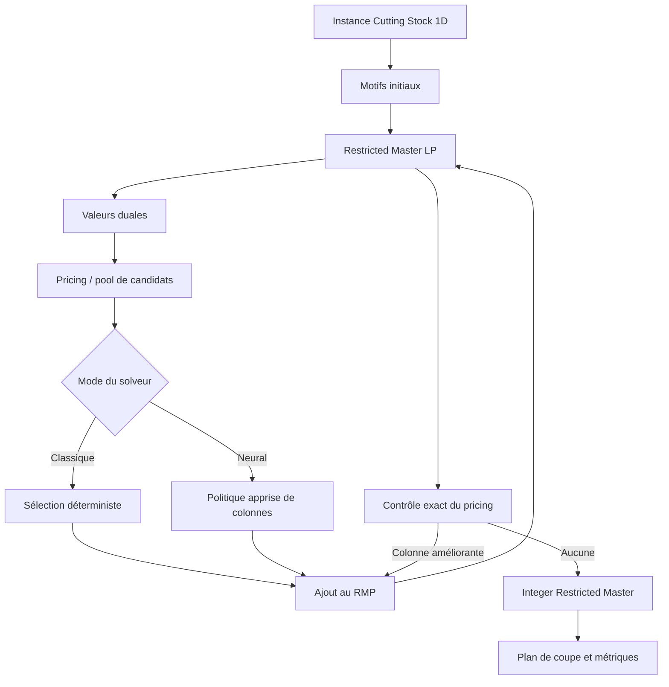

# Neural Cutting Stock — Learning to Accelerate Column Generation

> Projet de recherche focalisé sur une seule question : un modèle appris peut-il accélérer significativement la génération de colonnes pour le Cutting Stock 1D, tout en préservant la qualité de la méthode classique ?

## État du projet

La baseline classique de génération de colonnes est implémentée : validation des instances et du kerf, RMP linéaire, pricing entier exact, boucle de génération de colonnes, maître entier restreint, vérification indépendante et CLI structurée. La Phase 1 entre dans ses trois étapes de clôture : nettoyage, bilan réel, puis mise à jour documentaire. Aucun résultat de performance Neural CG ni composant neuronal n’existe encore.

## Motivation

Le Cutting Stock 1D apparaît notamment lors de la découpe de barres d’aluminium. Une commande regroupe des pièces de plusieurs longueurs et quantités, à produire à partir de barres de longueur fixe. Un plan de coupe doit satisfaire toute la demande avec le moins de barres possible.

Les formulations compactes deviennent difficiles lorsque le nombre de motifs de coupe possibles explose. La génération de colonnes évite de tous les énumérer : elle ne construit que les motifs utiles. Sur les grandes instances, les résolutions successives du problème maître, du pricing et la gestion des colonnes peuvent néanmoins devenir coûteuses.

## Hypothèse de recherche

Le réseau neuronal ne remplacera pas le solveur. Il apprendra à classer ou sélectionner les colonnes candidates les plus utiles au sein de la boucle de génération de colonnes.

Le projet sera considéré comme concluant uniquement si les expériences mesurées montrent simultanément :

- un objectif final identique ou explicitement comparable à celui du solveur classique ;
- un temps mur-à-mur inférieur, et non seulement une inférence rapide ;
- un gain qui se maintient ou augmente sur les instances les plus difficiles ;
- aucune fausse convergence grâce à une vérification exacte du pricing.

## Problème étudié

Une instance contient :

```python
stock_length: float
kerf: float
piece_lengths: list[float]
demands: list[int]
```

Un motif `a = (a_1, ..., a_m)` indique combien de pièces de chaque type sont découpées dans une barre. La convention initiale de trait de scie est volontairement conservative :

```text
sum(piece_length[i] * a[i]) + kerf * sum(a[i]) <= stock_length
```

Une largeur de coupe est donc réservée par pièce, y compris pour la dernière pièce de la barre. `kerf = 0` retrouve la formulation mathématique habituelle. Cette convention est une hypothèse de modélisation, pas un axe de recherche.

L’objectif maître est de minimiser le nombre de barres sous des contraintes de couverture de la demande. La formulation complète, le dual, le pricing et la définition de la perte matière sont détaillés dans [docs/formulation.md](docs/formulation.md).

## Approche classique

Le socle est une génération de colonnes pour le Cutting Stock 1D :

1. construire des motifs initiaux garantissant la faisabilité ;
2. résoudre la relaxation linéaire du Restricted Master Problem (RMP) ;
3. extraire les valeurs duales ;
4. résoudre exactement le pricing sous forme de sac à dos entier ;
5. ajouter tout motif de coût réduit négatif et recommencer ;
6. lorsque le pricing exact ne trouve plus d’amélioration, résoudre le RMP entier sur les motifs générés.

Le pricing exact certifie la convergence de la relaxation linéaire. En revanche, résoudre le maître entier restreint ne constitue pas, à lui seul, une preuve d’optimalité entière globale : une telle preuve demanderait une méthode de type branch-and-price. Les statuts et rapports ne devront jamais confondre ces garanties.

## Accélération apprise proposée

À partir de la Phase 4, un modèle simple recevra l’état courant du RMP, les duales et un ensemble de motifs candidats. Il classera les colonnes à ajouter. Une passe de pricing exacte restera obligatoire avant toute déclaration de convergence.



Le même cœur classique devra pouvoir exécuter, sur une même instance, les interfaces prévues :

```bash
uv run python -m neural_cutting_stock ... --solver classical
uv run python -m neural_cutting_stock ... --solver neural
```

Ces commandes seront ajoutées avec les solveurs ; elles ne sont pas encore disponibles dans la phase de fondation.

## Méthodologie de benchmark

Les instances synthétiques seront reproductibles par graine explicite. La difficulté sera étudiée selon plusieurs dimensions indépendantes : nombre de types, demande totale, longueur de barre, distributions des longueurs et demandes, et kerf. Les catégories `SMALL`, `MEDIUM`, `LARGE` et `XL` ne seront figées qu’après profilage du solveur classique.

Les exécutions classique et neuronale seront appariées sur exactement les mêmes instances, configurations et conditions matérielles. Le temps principal est le temps mur-à-mur de résolution. Les décompositions RMP, pricing, maître entier, gestion des colonnes et, plus tard, inférence neuronale servent à expliquer ce temps, jamais à le remplacer.

Le schéma de données, les règles de chronométrage, les statuts et le protocole de comparaison sont spécifiés dans [docs/benchmark_protocol.md](docs/benchmark_protocol.md).

## Résultats

La validation locale actuelle de la baseline classique comporte **68 tests réussis** et un contrôle Ruff réussi. Ce nombre décrit la correction testée du code au commit courant ; il ne constitue pas un résultat de performance. Le bilan reproductible de Phase 1 doit encore être publié dans `results/phase-1-summary.md`.

**Les expériences de performance sont encore en attente.** Aucun speedup ni graphique comparatif n’est publié à ce stade.

Le pipeline de visualisation produira à partir des mesures brutes validées :

- `results/runtime_comparison.png` — temps mur-à-mur de Classical CG et Neural CG par difficulté ;
- `results/speedup_by_size.png` — accélération appariée par catégorie de taille.

Les courbes de runtime ne seront présentées comme succès que pour les paires dont la qualité de solution respecte le seuil déclaré, par défaut une différence de zéro barre.

<!-- À activer uniquement lorsque le fichier provient de mesures réelles :

-->

## Organisation du dépôt

```text
neural-cutting-stock/
├── AGENTS.md                       # constitution et garde-fous
├── README.md
├── ROADMAP.md
├── pyproject.toml
├── configs/                        # configurations versionnées des expériences
├── docs/
│   ├── benchmark_protocol.md
│   └── formulation.md
├── results/                        # résultats et figures réellement mesurés
├── scripts/                        # points d’entrée fins, sans logique métier
├── src/neural_cutting_stock/
│   ├── problem/                    # modèle et validation d’instance
│   ├── solver/                     # RMP, pricing et orchestration CG
│   ├── benchmarks/                 # génération, exécution et enregistrement
│   └── visualization/              # figures issues des résultats validés
└── tests/
```

Le paquet `learning` ne sera créé qu’au début de la Phase 4, lorsque les profils et le format de trajectoire justifieront son interface.

## Installation de développement

Python 3.11 ou plus récent est requis.

```bash
uv sync --extra dev
uv run pytest
```

Le fichier `uv.lock` fixe l’environnement reproductible. Une installation editable avec `python -m pip install -e ".[dev]"` reste possible sans `uv`.

Le socle de résolution prévu repose sur NumPy et SciPy/HiGHS, sans licence commerciale. PyTorch ne deviendra une dépendance que lorsque le travail d’apprentissage commencera.

## Feuille de route

La progression est pilotée par les cases atomiques de [ROADMAP.md](ROADMAP.md) : une case correspond à une itération et un commit. Les six phases contiennent chacune quinze étapes initiales et peuvent recevoir des sous-étapes non cochées si le travail révèle un besoin réel. La prochaine itération exacte est **P1.13 : auditer et nettoyer la baseline classique**.

## Périmètre

Ce dépôt traite exclusivement du Cutting Stock 1D accéléré par apprentissage au sein d’une génération de colonnes. Les solveurs end-to-end neuronaux, Pointer Networks, métaheuristiques, Cutting Stock 2D/3D et autres problèmes combinatoires ne font pas partie du projet.
