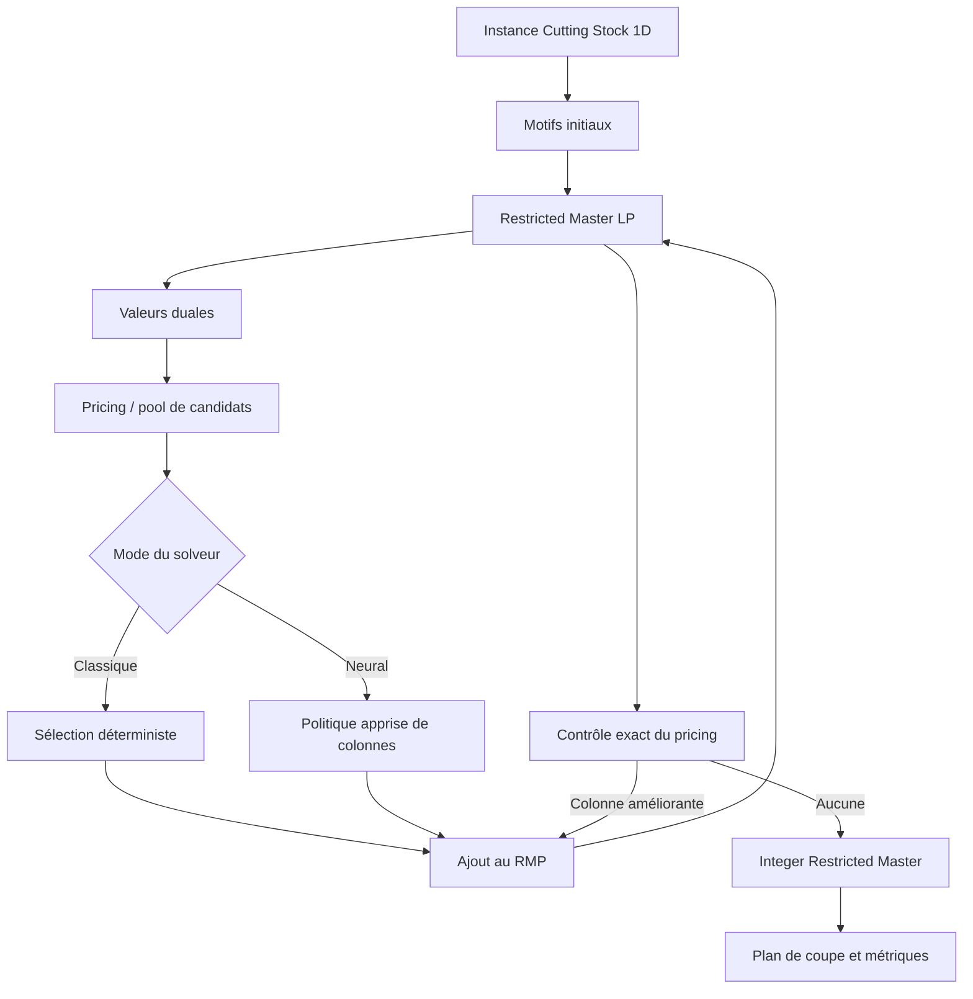

# Neural Cutting Stock — Learning to Accelerate Column Generation

> Projet de recherche focalisé sur une seule question : un modèle appris peut-il accélérer significativement la génération de colonnes pour le Cutting Stock 1D, tout en préservant la qualité de la méthode classique ?

## État du projet

Les Phases 1, 2 et 3 sont clôturées. La baseline classique de génération de colonnes comprend la validation des instances et du kerf, le RMP linéaire, le pricing entier exact, la boucle de génération de colonnes, le maître entier restreint, la vérification indépendante et la CLI structurée. La Phase 2 a ajouté un générateur déterministe, un schéma de résultats versionné, un runner classique, la persistance des échecs et limites de ressources, ainsi qu’un profilage par composants. La Phase 3 a ajouté un schéma de trajectoire rejouable, des partitions sans fuite et un petit corpus validé. Aucun composant neuronal ni résultat de performance Neural CG n’existe encore.

## Motivation

Le Cutting Stock 1D apparaît notamment lors de la découpe de barres d’aluminium. Une commande regroupe des pièces de plusieurs longueurs et quantités, à produire à partir de barres de longueur fixe. Un plan de coupe doit satisfaire toute la demande avec le moins de barres possible.

Les formulations compactes deviennent difficiles lorsque le nombre de motifs de coupe possibles explose. La génération de colonnes évite de tous les énumérer : elle ne construit que les motifs utiles. Sur les grandes instances, les résolutions successives du problème maître, du pricing et la gestion des colonnes peuvent néanmoins devenir coûteuses.

## Hypothèse de recherche

Le réseau neuronal ne remplacera pas le solveur. Il apprendra à classer ou sélectionner les colonnes candidates les plus utiles au sein de la boucle de génération de colonnes.

Le projet sera considéré comme concluant uniquement si les expériences mesurées montrent simultanément :

- un objectif final identique ou explicitement comparable à celui du solveur classique ;
- un temps mur-à-mur inférieur, et non seulement une inférence rapide ;
- un gain qui se maintient ou augmente sur les instances les plus difficiles ;
- aucune fausse convergence grâce à une vérification exacte du pricing.

## Problème étudié

Une instance contient :

```python
stock_length: float
kerf: float
piece_lengths: list[float]
demands: list[int]
```

Un motif `a = (a_1, ..., a_m)` indique combien de pièces de chaque type sont découpées dans une barre. La convention initiale de trait de scie est volontairement conservative :

```text
sum(piece_length[i] * a[i]) + kerf * sum(a[i]) <= stock_length
```

Une largeur de coupe est donc réservée par pièce, y compris pour la dernière pièce de la barre. `kerf = 0` retrouve la formulation mathématique habituelle. Cette convention est une hypothèse de modélisation, pas un axe de recherche.

L’objectif maître est de minimiser le nombre de barres sous des contraintes de couverture de la demande. La formulation complète, le dual, le pricing et la définition de la perte matière sont détaillés dans [docs/formulation.md](docs/formulation.md).

## Approche classique

Le socle est une génération de colonnes pour le Cutting Stock 1D :

1. construire des motifs initiaux garantissant la faisabilité ;
2. résoudre la relaxation linéaire du Restricted Master Problem (RMP) ;
3. extraire les valeurs duales ;
4. résoudre exactement le pricing sous forme de sac à dos entier ;
5. ajouter tout motif de coût réduit négatif et recommencer ;
6. lorsque le pricing exact ne trouve plus d’amélioration, résoudre le RMP entier sur les motifs générés.

Le pricing exact certifie, à la tolérance numérique déclarée, l’optimalité de la relaxation linéaire du maître complet lorsque aucune colonne améliorante n’est trouvée. Le maître entier final est résolu uniquement sur les colonnes générées : son statut est donc `optimal_over_generated_columns_only`, et ne constitue pas une preuve d’optimalité entière globale sans branch-and-price ou preuve additionnelle. Les contraintes de capacité et de demande sont vérifiées indépendamment du solveur.

## Schéma des trajectoires

La Phase 3 persiste chaque exécution classique dans le schéma versionné `cg-trajectory-v2`. Une
trajectoire contient des métadonnées d’identité et d’environnement (`trajectory_id`,
`instance_id`, graine, configuration, commit, versions et matériel), les dimensions de l’instance,
les tolérances numériques, l’ordre des types dans les duales et la convention
`nonnegative_covering_dual`. Elle contient ensuite une séquence contiguë d’itérations avec l’état du
RMP, les duales, les valeurs de colonnes, les comptes de colonnes, les motifs candidats et
sélectionnés lorsqu’ils sont disponibles, le fallback exact, le meilleur coût réduit et les durées
RMP, pricing et gestion des colonnes. Le statut terminal est `converged`, `resource_limit` ou
`failed`, avec une raison de terminaison.

Le corpus et son manifeste utilisent `phase-3-corpus-v1`. Le manifeste associe chaque trajectoire à
son instance, sa graine, sa famille, sa partition, son chemin et son hash SHA-256. Le lecteur valide
le schéma, vérifie les hashes et rejoue chaque trajectoire avec le solveur classique exact avant de
l’accepter. Les détails de l’implémentation sont dans
[`src/neural_cutting_stock/benchmarks/trajectory.py`](src/neural_cutting_stock/benchmarks/trajectory.py)
et [`data/phase-3-corpus/README.md`](data/phase-3-corpus/README.md).

## Accélération apprise proposée

À partir de la Phase 4, un modèle simple recevra l’état courant du RMP, les duales et un ensemble de motifs candidats. Il classera les colonnes à ajouter. Une passe de pricing exacte restera obligatoire avant toute déclaration de convergence.

L'interface versionnée `learning-interface-v1` est définie dans
[`src/neural_cutting_stock/learning/interfaces.py`](src/neural_cutting_stock/learning/interfaces.py).
Elle transporte un `PricingState` (instance, ordre des types, état du RMP et duales), des
`PatternCandidate` issus du pricing classique, des `PatternScore` finis et une
`ColumnSelectionDecision`. Cette frontière ne sélectionne aucune colonne et ne certifie jamais la
convergence ; le pricing exact reste sous la responsabilité du solveur classique.



Le même cœur classique devra pouvoir exécuter, sur une même instance, les interfaces prévues :

```bash
uv run python -m neural_cutting_stock ... --solver classical
uv run python -m neural_cutting_stock ... --solver neural
```

Ces commandes seront ajoutées avec les solveurs ; elles ne sont pas encore disponibles dans la phase de fondation.

## Protocole et profils de benchmark

Les instances synthétiques sont reproductibles par graine explicite, paramètres de génération et identifiant dérivé des données normalisées. La difficulté est étudiée selon plusieurs dimensions indépendantes : nombre de types, demande totale, longueur de barre, distributions des longueurs et demandes, et kerf. Les catégories `SMALL`, `MEDIUM`, `LARGE` et `XL` sont figées par `size-class-v1` à partir du temps mur-à-mur classique mesuré, et non de la demande seule : `SMALL < 0.015997 s`, `MEDIUM < 0.06385 s`, `LARGE < 0.1433 s`, puis `XL`.

Les exécutions classique et neuronale seront appariées par `instance_id`, avec les mêmes configurations, ressources et conditions matérielles. Le temps principal est le temps mur-à-mur de l’entrée dans `solve` jusqu’au plan vérifié. Les décompositions RMP, pricing, maître entier, gestion des colonnes, vérification et, plus tard, inférence neuronale servent à expliquer ce temps, jamais à le remplacer. Chaque tentative, y compris échec et timeout, reste dans les données ; `objective_difference_vs_classical` est vérifié avant toute agrégation de runtime.

Le schéma `benchmark-run-v1`, les règles de chronométrage, les statuts et le protocole de comparaison sont spécifiés dans [docs/benchmark_protocol.md](docs/benchmark_protocol.md). Le profil classique publié est [baseline-profile-v1](results/phase-2-baseline-profile.json), avec son [bilan détaillé](results/phase-2-summary.md).

## Résultats de Phase 2

La validation de Phase 1 comporte **68 tests réussis** et un contrôle Ruff réussi, exécutés avec les dépendances verrouillées. Le bilan et l’environnement sont publiés dans [`results/phase-1-summary.md`](results/phase-1-summary.md). Ce nombre décrit la correction testée du code ; il ne constitue pas un résultat de performance.

La Phase 2 a enregistré **8 exécutions classiques réussies** sur les graines `11` et `12`, avec plans faisables et statut `optimal_lp_restricted_ip`. Le profil contient 3 exécutions `SMALL`, 1 `MEDIUM`, 3 `LARGE` et 1 `XL`. Le temps médian observé va de `0.006309 s` (`SMALL`) à `0.171033 s` (`XL`). Le goulot mesuré est `pricing_runtime`, avec **65,32 %** du temps instrumenté cumulé. Ces mesures décrivent la baseline classique et ne constituent pas un speedup.

Le profil et les figures ont été produits à partir des données persistées avec :

```bash
uv run python scripts/plot_phase2_profile.py \
  --profile results/phase-2-baseline-profile.json \
  --output-dir results
```

La Phase 2 est clôturée : le corpus, le protocole, les seuils de taille et le goulot sont versionnés et traçables. Les résultats neuronaux restent hors périmètre jusqu’aux phases suivantes.

## Résultats et clôture de Phase 3

Le corpus publié est `phase-3-small-v1`, au schéma `phase-3-corpus-v1`. Son plan de partitions,
figé avant la collecte sous `trajectory-partitions-v1`, sépare les graines et les familles : la
graine 11 et sa famille sont réservées à `train`, 12 à `validation`, et 13 à `test`. Les ensembles
de graines et de familles sont disjoints et une instance n’est acceptée que lorsque les deux
identifiants désignent la même partition.

Le corpus contient trois trajectoires et trois instances, une par partition, toutes au statut
`converged`. Il contient trois itérations, zéro colonne ajoutée et zéro motif sélectionné. La
répartition publiée est :

| Partition | Trajectoires | Itérations | Types de pièces |
|---|---:|---:|---:|
| train | 1 | 1 | 2 |
| validation | 1 | 1 | 3 |
| test | 1 | 1 | 4 |

Chaque hash du manifeste correspond au fichier persistant et chaque trajectoire a été rejouée sans
erreur par le solveur classique exact. Ce corpus est une collecte validée, pas un benchmark de temps :
ses durées ne sont pas agrégées ni interprétées comme une performance. Il ne permet pas encore
d’évaluer un modèle appris, un classement de colonnes ou un speedup. Les résultats et les deux
figures descriptives sont publiés dans [`results/phase-3-summary.md`](results/phase-3-summary.md),
[`results/phase3_corpus_structure.png`](results/phase3_corpus_structure.png) et
[`results/phase3_instance_dimensions.png`](results/phase3_instance_dimensions.png).

Le corpus peut être régénéré puis visualisé avec :

```bash
uv run python scripts/build_phase3_corpus.py --output-dir data/phase-3-corpus
uv run python scripts/plot_phase3_corpus.py \
  --manifest data/phase-3-corpus/manifest.json \
  --output-dir results
```

La Phase 3 est clôturée : les trajectoires sont versionnées, validées et rejouables, les partitions
sont fixées sans fuite connue, et la collecte n’altère pas les décisions du solveur classique dans
les tolérances déclarées. La Phase 4 pourra maintenant introduire la couche apprise, sans remplacer
le pricing exact ni le contrôle exact de convergence.

Le pipeline de visualisation produira à partir des mesures brutes validées :

- `results/runtime_comparison.png` — temps mur-à-mur de Classical CG et Neural CG par difficulté ;
- `results/speedup_by_size.png` — accélération appariée par catégorie de taille.

Les courbes de runtime ne seront présentées comme succès que pour les paires dont la qualité de solution respecte le seuil déclaré, par défaut une différence de zéro barre.

<!-- À activer uniquement lorsque le fichier provient de mesures réelles :

-->

## Organisation du dépôt

```text
neural-cutting-stock/
├── AGENTS.md                       # constitution et garde-fous
├── README.md
├── ROADMAP.md
├── pyproject.toml
├── configs/                        # configurations versionnées des expériences
├── docs/
│   ├── benchmark_protocol.md
│   └── formulation.md
├── data/phase-3-corpus/             # trajectoires, manifeste et partitions validés
├── results/                        # résultats et figures réellement mesurés
├── scripts/                        # points d’entrée fins, sans logique métier
├── src/neural_cutting_stock/
│   ├── problem/                    # modèle et validation d’instance
│   ├── solver/                     # RMP, pricing et orchestration CG
│   ├── benchmarks/                 # génération, exécution et enregistrement
│   └── visualization/              # figures issues des résultats validés
└── tests/
```

Le paquet `learning` ne sera créé qu’au début de la Phase 4, lorsque les profils et le format de trajectoire justifieront son interface.

## Installation de développement

Python 3.11 ou plus récent est requis.

```bash
uv sync --extra dev
uv run pytest
```

Le fichier `uv.lock` fixe l’environnement reproductible. Une installation editable avec `python -m pip install -e ".[dev]"` reste possible sans `uv`.

Le socle de résolution prévu repose sur NumPy et SciPy/HiGHS, sans licence commerciale. PyTorch ne deviendra une dépendance que lorsque le travail d’apprentissage commencera.

## Feuille de route

La progression est pilotée par les cases atomiques de [ROADMAP.md](ROADMAP.md) : une case correspond à une itération et un commit. Les six phases contiennent chacune quinze étapes initiales et peuvent recevoir des sous-étapes non cochées si le travail révèle un besoin réel. La prochaine itération est toujours la première case non cochée de la roadmap ; son identifiant n’est pas recopié ici afin d’éviter toute information obsolète.

## Périmètre

Ce dépôt traite exclusivement du Cutting Stock 1D accéléré par apprentissage au sein d’une génération de colonnes. Les solveurs end-to-end neuronaux, Pointer Networks, métaheuristiques, Cutting Stock 2D/3D et autres problèmes combinatoires ne font pas partie du projet.
